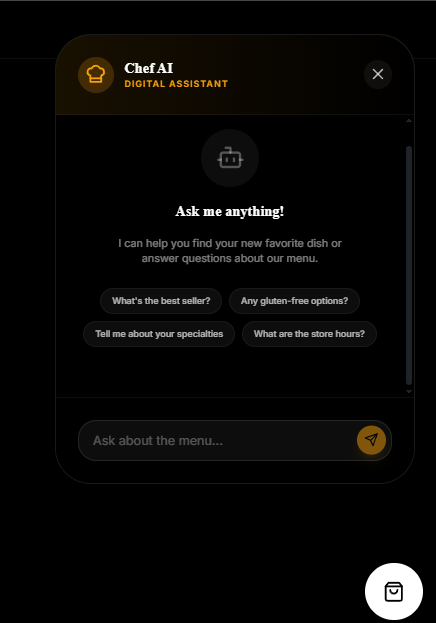
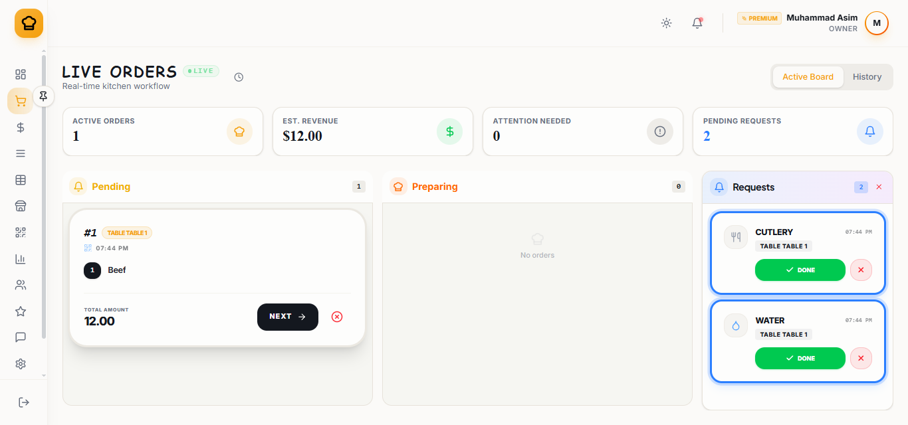
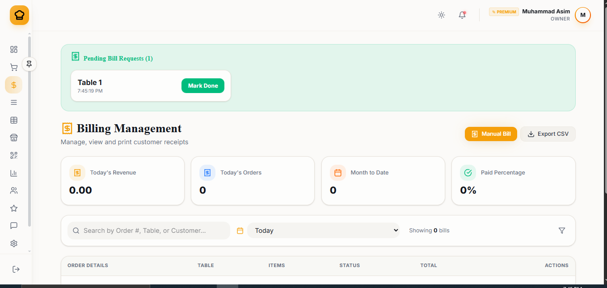

# 🍳 ChefOS: The Intelligent Restaurant Operating System


> **"Standard POS systems just track sales. ChefOS manages your entire business logic."**

ChefOS is a high-performance, full-stack ecosystem designed to solve the most critical pain points in the modern restaurant industry: **guest wait anxiety**, **order inaccuracy**, and **back-of-house chaos**.

---

## 📈 Business Impact & ROI
ChefOS isn't just an app; it's a revenue engine. By digitizing the end-to-end dining experience, we deliver measurable growth:

- **+18% Revenue Lift**: Driven by AI-powered upselling and smart dish recommendations.
- **40% Faster Service**: Reduced order-to-table latency through friction-less QR ordering.
- **12 Minutes Saved/Turn**: Automated digital checkouts allow for higher table turnover rates.
- **~0% Error Margin**: Real-time kitchen hub synchronization eliminates communication gaps.

---

## 🧩 The Problem vs. The ChefOS Solution

| The Industry Problem | Our Solution | The Result |
| :--- | :--- | :--- |
| **High Wait Times** | Instant QR Ordering | **40% Faster Service** |
| **Missed Revenue** | AI Chef Recommendations | **+18% Check Size** |
| **Staff Overload** | Digital Self-Checkout | **Lower Operational Costs** |
| **Data Blindness** | Real-Time Analytics | **Predictive Staffing** |

---

## 💎 Core Ecosystem Features

### 1. The Command Center (Admin Dashboard)
A high-velocity dashboard for owners to track revenue, manage staff permissions, and monitor live kitchen performance.


### 2. AI Smart Waiter (Chef AI)
Our proprietary AI assistant handles customer queries and intelligently suggests pairings, acting as a tireless 24/7 sales agent.


### 3. Kitchen Operations Hub
Real-time ticket prioritization and live order status tracking to keep the heat where it belongs—on the food, not the frustration.


### 4. Seamless Onboarding & Security
Quick onboarding flow for new restaurants with secure authentication and role-based access control.


---

## 🛠 Technical Architecture

ChefOS is built with a focus on **concurrency**, **real-time synchronization**, and **offline resilience**.

- **Frontend**: React 19, Vite, Tailwind CSS, Framer Motion.
- **Backend**: Node.js, Express, Socket.io (for live updates).
- **Database**: MongoDB with Mongoose ODM.
- **Mobile**: Progressive Web App (PWA) with smart caching for offline ordering.
- **DevOps**: Dockerized local environment for consistent development.

---

## 🚀 Deployment & Installation

### Core Setup
```bash
# Clone the repository
git clone https://github.com/your-username/chefos.git

# Install root & frontend dependencies
npm install

# Setup Backend
cd backend
npm install
```

### Environment Variables
Create a `.env` in the `/backend` directory:
```env
PORT=5000
MONGODB_URI=your_mongodb_uri
JWT_SECRET=your_jwt_secret
GEMINI_API_KEY=your_google_ai_key
CLOUDINARY_URL=your_cloudinary_config
```

### Start Development
```bash
# Root directory - Start Frontend
npm run dev

# Backend directory - Start Server
npm run dev
```

---

## 📸 Snapshots of Excellence

| QR Management | Billing & Checkout | Staff Management |
| :--- | :--- | :--- |
|  |  |  |

---

## 💡 Why recruiters should care?
This project demonstrates complete ownership of a **complex business domain**. It features:
- **Real-time bi-directional communication** via Sockets.
- **State-of-the-art UI/UX** with glassmorphism and motion.
- **Data persistence & caching strategies** for high availability.
- **AI Integration** to solve real-world revenue problems.

---

© 2026 **ChefOS Intelligence**. All rights reserved.
Developed by a solution-oriented engineer.
